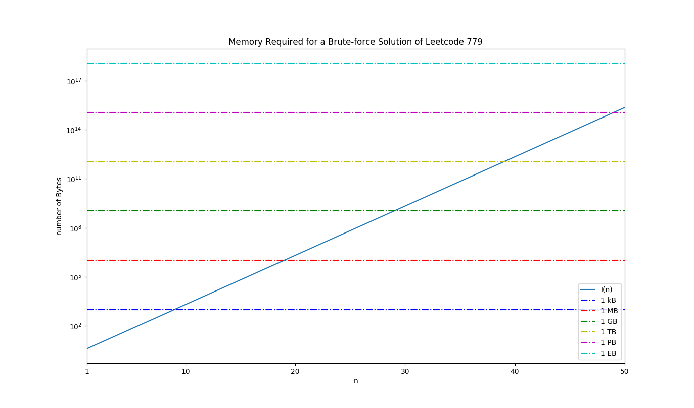

### Introduction
Let's imagine a table that we are constructing via an algorithm. In the first row of the table, we put the character $0$. For every row in the table thereafter, from $2$ to $n$, we construct it from the preceding row using the same two rules:

1. If there is a $0$, it is replaced with $01$.
2. If there is a $1$, it is replaced with $10$.

So the first $6$ rows would look like this:

$$
\begin{aligned}
&n=1: 0 \\
&n=2: 01 \\
&n=3: 0110 \\
&n=4: 01101001 \\
&n=5: 0110100110010110 \\
&n=6: 01101001100101101001011001101001
\end{aligned}
$$

$\hspace{1cm}$ Now, based on the information that has been presented, the problem we want to solve is the following statement. Given two integers, $n$, and $k$, return the $k$th digit in the $n$th row. 

### Solution Approach
$\hspace{1cm}$ As with basically every Leetcode problem, there are numerous videos you can find online of people explaining a solution. This one, [Leetcode 779. K-th Symbol in Grammar](https://leetcode.com/problems/k-th-symbol-in-grammar/) is no different, but unlike those videos I am not going to solve this problem using a binary tree, but rather an approach I came up with myself that is based on a [recurrence relation which describes the generated sequence](#recurrence-relation).

$\hspace{1cm}$ One way to describe the solution to this problem is as the output of the function, $B_{n}(k)$, which evaluates to the $k$th digit in the $n$th row. *Wait*, you might be saying. *Recurrence relation? Binary tree? Why don't you just forget all that complicated-sounding math, and brute force it?* Like all brute force algorithms, ones that solve a problem by computing all the possible cases and then searching for the answer among them, we are limited by what we have the computational resource for. 

### Brute Force - Memory Requirements
$\hspace{1cm}$ How much computational resource is required to store the binary number represented by the $n$th row in the table we are constructing? Well, the base case of $n=1$ involves only a single binary digit, which for convenience's sake we can consider to be stored in an `int` data type (32 bits), because that is the simplest way to implement a brute force approach at a first pass. 

$32$ bits is equivalent to $4$ bytes, and increasing $n$ by $1$ doubles the number of digits we need to store, so we can represent the amount of information (in bytes) that we need with the following function,

$$
I(n) = 4*2^{n-1}
$$

The following NumPy / Maplotlib script visualizes this, alongside with lines that represent various important scales, e.g., 1 kilobyte (kB), 1 megabyte (MB), 1 gigabyte (GB), 1 terabyte (TB), 1 petabyte (PB), 1 exabyte (EB).

```
import matplotlib.pyplot as plt
import numpy as np

def I(n):
	return 4*2**(n-1)

nmax = 50

n = np.arange(1,nmax+1)

bytes_per_kB = np.full(n.size,1024)
bytes_per_MB = bytes_per_kB * 1024
bytes_per_GB = bytes_per_MB * 1024
bytes_per_TB = bytes_per_GB * 1024
bytes_per_PB = bytes_per_TB * 1024
bytes_per_EB = bytes_per_PB * 1024

plt.semilogy(n,I(n),label='I(n)')
plt.semilogy(n,bytes_per_kB,'b-.',label='1 kB')
plt.semilogy(n,bytes_per_MB,'r-.',label='1 MB')
plt.semilogy(n,bytes_per_GB,'g-.',label='1 GB')
plt.semilogy(n,bytes_per_TB,'y-.',label='1 TB')
plt.semilogy(n,bytes_per_PB,'m-.',label='1 PB')
plt.semilogy(n,bytes_per_EB,'c-.',label='1 EB')

plt.xlabel('n')
plt.ylabel('number of Bytes')
plt.title('Memory Required for a Brute-force Solution of Leetcode 779')

plt.xlim(1,50)

xmarks = [1,10,20,30,40,50]

plt.xticks(xmarks)

plt.legend()

plt.show()
```



This graph is very interesting because it shows how quickly the amount of memory we need to solve this problem will scale to unrealistic heights. Unless we wish to dedicate an entire server to the problem (haha), the most RAM we can hope to dedicate towards this problem, without taking the speed hit from working with main memory, is somewhere around 64 GB (really less because the operation of the system is going to need some too). That gives us, roughly, the ability to store the $n=32$-nd or $33$-rd binary number. 

Installing a 1 TB hard drive (or SSD if you want to break the bank) in our workstation will give us access to a little more of the solution space, but to reach $n=40$ we would need *two* of them, just to *hold the data*. At this point, not only would there be room for nothing else on the workstation except the operating system, source code, and C compiler of our choice (because this is one of those times when you would really need the power of C), but even the most well-written, optimized C would be slow as hell at these problem sizes as large chunks of data would constantly be shuffled into and out of main memory, the slowest level of the memory hierarchy. 

That's a bit of a tangent, but hopefully you get the picture. A brute-force approach to this problem is simply a non-starter, except for a very limited span. If you're intrigued / confused by what a "memory hierachy" is, stay tuned for a post about them. Also, yes, I know that it is silly and wasteful to store a binary digit in an entire 32-bit `int`, but ask yourself if having 32 times the space would really matter (it wouldn't).

### Brute Force - Time Complexity
For the sake of completeness, let me talk a little about the time complexity of the implementation I described for the brute-force solution to this problem. If you're not interested, then please, by all means skip down to [the section where 14 lines of code do what an entire server couldn't](#recurrence-relation---elegant-and-efficient).

### Recurrence Relation - Elegant and Efficient
If you want an elegant, efficient, powerful, and recursive solution to this problem, then here it is:
```
int kthGrammar(int n, int k) {
        // base case
        if (n == 1 && k == 1){
            return 0;
        }
        // Recurrence relation
        else if (k < pow(2, n-2) + 1) {
            return kthGrammar(n-1, k);
        }
        else if (k >= pow(2, n-2) + 1){
            return !(kthGrammar(n-1, k - pow(2,n-2)));
        }
        return -1;
    }
```
Before we break this down, let's talk about the mathematics of this problem. Programming is, after all, just getting the computer to do the math for us. Let's take a look at the first six terms of the sequence again,

$$
\begin{aligned}
&n=1: 0 \\
&n=2: 01 \\
&n=3: 0110 \\
&n=4: 01101001 \\
&n=5: 0110100110010110 \\
&n=6: 01101001100101101001011001101001
\end{aligned}
$$

$\hspace{1cm}$ Recall that the goal is to find an exact expression for the generating function of the sequence, $B_{n}(k)$. How are we to do this? Well, there's something we can notice about the adjacent terms of the sequence, $n-1$, and $n$. That something is, namely, that the $n$-th term is just the $n-1$th term with its inverted self appended on the end! Fundamentally, this property arises from the rules that generate the new binary number. Since every $0$ becomes $01$ (the original binary digit + its inversion), and every $1$ becomes $10$ (the original binary digit + its inversion), and every binary number can be written as a concatenation of a sequence of these digits, this property is naturally embedded in the structure of the problem. 

$\hspace{1cm}$ Now, we just need to find a way to express this mathematically using the language of a recurrence relation, i.e., an equation that relates $B_{n}(k)$ to $B_{n-1}(k)$. The trick here is to figure out what the value of k is that separates the region where we have the digits from the previous number and the one where we have their inversion. Based on the previous paragraph we can write the relation as,

$$
B_{n}(k) = 
\begin{cases}
B_{n-1}(k) & \text{if $k \lt k_{bound}$} \\
!B_{n-1}(k) & \text{if $k \geq k_{bound}$}
\end{cases}
$$

What's $k_{bound}$? We can figure that out by writing out the $n$-th member of this sequence,

$$
B_{n}(k) = B_{n-1}(1)B_{n-1}(2) \ldots B_{n-1}(k_{bound}-1)!B_{n-1}(1)!B_{n-1}(2) \ldots !B_{n-1}(2^{n-1})
$$

Apparently, it is just the size (number of digits) of the previous number + 1!

$\hspace{1cm}$ Finally, there is one last point we need to figure out before we can implement thisin code. The mathematics of the problem, i.e., the recurrence relation embedded in it, means that a recursive solution is the correct one. The base case is clear, it's the situation when $n=1$ and $k=1$, returning a value of 0 as the problem specified. We also know what to do in the case when $k \lt k_{bound}$, we just return $B_{n-1}(k)$. But what do we return when $k \geq k_{bound}$? We need to return a value using $k \in \[1,2^{n-2}]$, because that's where the previous digit is defined, while the value we are working with is in the range $k \in \[2^{n-2}+1,2^{n-1}\]$. If we subtract $2^{n-2}$ from our current value of k, then we bring it into exactly the range that we need ($2^{n-1} = 2 * 2^{n-2} = 2^{n-2} + 2^{n-2}$)! 

$\hspace{1cm}$ Putting these pieces together, we obtain the code at the beginning of this section

```
int kthGrammar(int n, int k) {
        // base case
        if (n == 1 && k == 1){
            return 0;
        }
        // Recurrence relation
        else if (k < pow(2, n-2) + 1) {
            return kthGrammar(n-1, k);
        }
        else if (k >= pow(2, n-2) + 1){
            return !(kthGrammar(n-1, k - pow(2,n-2)));
        }
        return -1;
    }
```

### Recurrence Relation - Time Complexity
So, how fast does this code run? Obviously, the space complexity is *vastly* superior to the brute-force approach: $O(1)$ compared to $O(2^{n})$. 

### Conclusion
$\hspace{1cm}$ Thank you for getting to the end of this post. I hope that what I wrote was instructive and helped you to learn something, or at the very last was an entertaining walk-through of an interesting problem. 

$\hspace{1cm}$ As a final takeaway, I want to note how this problem illustrates the importance of elegant, powerful algorithms to writing high-performing code. Powerful machines are only one part of the equation to high-performance computing, and as any computer scientist will tell you, the truth is that even the most powerful machines are little more than a space heater when running a poorly-designed algorithm.    