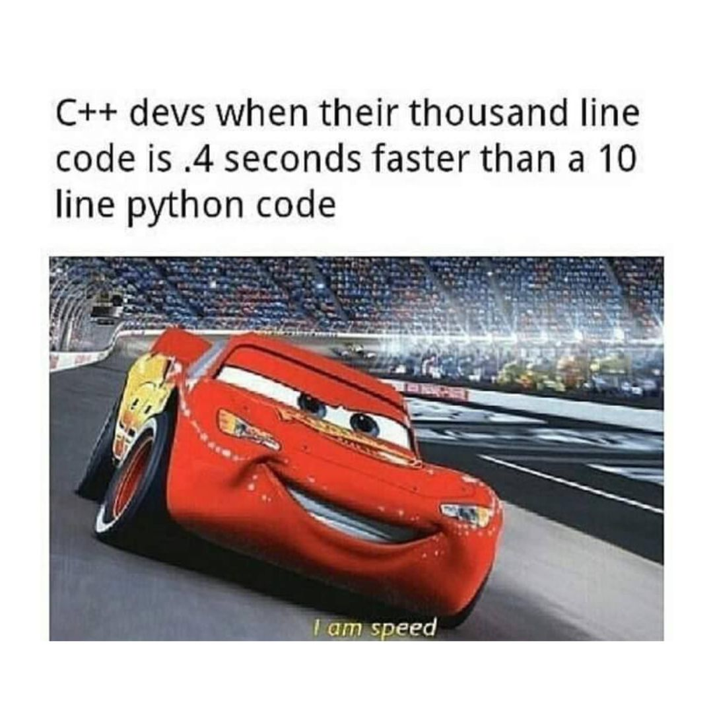

WIP - Copied from a LinkedIn draft, and still working on it :)

Why do I love CUDA? One big reason is how it lets you just "Plug and Play" with the most powerful piece of massively parallel, integrated, computing hardware that human engineering has ever invented. I am speaking about the GPU, of course. I don't intend to turn this post into a history lesson on parallel computing, nor on the GPU because volumes have been written on the subject[^1][^,][^2][^,][^3], and what I am more interested in is showing how to get performance out of the device.

Before CUDA was developed by Ian Buck and his team at NVIDIA in the early-2000s, programming a GPU meant translating your application into the language of shaders. These are essentially specifications for how triangles in a mesh of them are colored in. This also meant working with graphics languages like OpenGL, or Vulkan, which require you to engage in the laborious process of talking directly to the GPU. CUDA abstracts away these worries. In my opinion this is one of the greatest strengths of the platform. 

For anyone who has ever written any [Visualization Toolkit](https://vtk.org/) (VTK) code, speaking of course about the C++ dialect, and not the Python version which is mostly just a shorthand for C++, I would liken the difference to being similar to that between writing VTK, and using popular Python visualization packages like Matplotlib. For anyone reading this who hasn't that experience, it's kind of like buying a car vs. being the shipped the parts for one, and having to put it together yourself. VTK allows us to create extremely powerful visualizations, but at the expense of having to specify everything ourselves. There are pros and cons to this. For one, you have a lot more flexibility, and a lot more freedom. For another, you have a lot more legwork to do because you have to specify the [rendering pipeline](https://vtk.org/vtk-textbook/) yourself. 

For example, with Matplotlib, if we wanted to plot a simple graph between two variables, we can do so in just a handful of lines of code, 

```python
import matplotlib.pyplot as plt
import numpy as np

x = np.linspace(-np.pi,np.pi)
y = np.sin(x)

plt.plot(x, y)

plt.show()
```
An equivalent code in VTK would be many more lines than this. The essence of why is that a lot is being encapsulated when we call statements like ```plt.plot()```, and ```plt.show()```. The central data structure in Matplotlib is that of the [`Artist`](https://matplotlib.org/stable/tutorials/artists.html). This is what handles the rendering pipeline. If you work with VTK for any extended period of time, then you will find yourself starting at what is called `boilerplate` in the software industry, i.e., repeated code. Here is the boilerplate for getting data from a source. Here is the boilerplate for mapping that data to an actor. Here is the boilerplate for placing that actor into a scene, meaning connecting it with a renderer, and then connecting that renderer with a window. Oh! And we can't forget the camera or how else would be able to see anything! At some point you will grow tired of the verbosity, and just want something that handles it all for you.  

Why we are able to be so succinct in Python is because it's a high-level, **interpreted** language. There's a common misconception amongst novice programmers that Python is faster than C++, or just as fast, captured by memes such as the following, 



This is untrue. For every statement in Python, a program called an interpreter reads it and based on the state of the runtime, and current context, decides what to do. This can be very inefficient when compared to a **compiled** program which is just a list of instructions for the machine to execute. Yes, I know, you probably have heard stories of professor's challenging their class to beat their Python with C++, and the class losing. This is a bit like a beater challenging a muscle car to race on the freeway. Underneath the hood of the beater car is an engine that puts the muscle car to shame. In Python's case, this engine beneath the hood is C, but it's better than just the C that a student would be able to write in several hours, because it's C that someone, or a team of someone's, armed with a compiler spent some portion of their career optimizing. 

I know that I have drifted far afield from my main point in talking about VTK, and then drifted again in talking about Python, but that's what a background in plasma physics gets you. Just like what's going on whether you use VTK, or Matplotlib, or some other package like Seaborn, etc.., is the implementation of a rendering pipeline, what's going on behind the scenes of GPU code is a lot of buffers talking to each other. What CUDA presents applications programmers with to encapsulate all of these talking buffers, so that they can focus on the algorithm instead, is the idea of an execution configuration, and this is one of the software's great strokes of genius. 

You see, I said this post wasn't going to turn into a history lesson, but it's important to understand the history of a field because science is a human endeavor, and to understand where we are and what we are doing, we must understand where we came from. What makes as it allows one to focus on writing "MPI-like" kernels that the execution configuration merely specifies the structure of the thread teams for. When a kernel is launched each thread will go through and execute its statements, similar to the way MPI works. 

In general, these teams take the structure of a 3D block of threads, which are themselves a member of a 3D grid of threadblocks, each of which can have at most 1024 threads in total. This 6D structure is what's known as an "execution configuration", and every global device kernel requires one to launch. 


One of the first keys to parallel programming is finding a way to partition the work amongst your thread team. CUDA makes this easy by assigning global and local coordinates to the threads. 


The code snippet below shows what this looks like in practice using the example of a global device kernel that solves the Ideal MHD system of PDEs using an approach that minimizes memory operations by leveraging register variables. 


The local coordinates of a thread, meaning in its threadblock, are given by threadIdx.{x,y,z}. 


The number of threads along a dimension of the threadblocks are given by blockDim.{x,y,z}. 


The global coordinates of the threadblocks in the execution grid are given by blockIdx.{x,y,z}.  


The number of threadblocks along a given dimension of the grid is given by gridDim.{x,y,z}


You can use these innate values to index a given thread into, and then stride through, a computational grid. Since each thread has a unique set of coordinates, you can prevent data hazards by striding them along a dimension of the computational grid a distance equal to the number of threads along the same dimension of the execution grid. 


This makes developing a first-pass implementation fairly straightforward once you see how this works, and after all, developer time is more valuable than compute time!

<!-- References -->
[^1:] [Peddie, J. (2022). The History of the GPU: Steps to Invention. Springer.](https://www.amazon.com/History-GPU-Steps-Invention/dp/3031109678/ref=pd_bxgy_thbs_d_sccl_2/130-6697209-0481822?pd_rd_w=RQC0K&content-id=amzn1.sym.53b72ea0-a439-4b9d-9319-7c2ee5c88973&pf_rd_p=53b72ea0-a439-4b9d-9319-7c2ee5c88973&pf_rd_r=V0ZQ31C3Z7Y99YWJV4D3&pd_rd_wg=UMJft&pd_rd_r=e2d02db7-a450-4705-8863-87d804ef7f92&pd_rd_i=3031109678&psc=1)

[^2:] [Peddie, J. (2022). The History of the GPU: Eras and Environments. Springer.](https://www.amazon.com/History-GPU-Eras-Environment/dp/3031135806/ref=pd_bxgy_thbs_d_sccl_1/130-6697209-0481822?pd_rd_w=8gNkU&content-id=amzn1.sym.53b72ea0-a439-4b9d-9319-7c2ee5c88973&pf_rd_p=53b72ea0-a439-4b9d-9319-7c2ee5c88973&pf_rd_r=BFPGV0TY1S3GYN1T5BW2&pd_rd_wg=eaSoY&pd_rd_r=cbe65818-f2b5-41ff-8aef-f070e309f87a&pd_rd_i=3031135806&psc=1)

[^3:] [Peddie, J. (2022). The History of the GPU: New Developments. Springer.](https://amazon.com/History-GPU-New-Developments/dp/303114046X/ref=pd_lpo_d_sccl_1/130-6697209-0481822?pd_rd_w=pBHZJ&content-id=amzn1.sym.4c8c52db-06f8-4e42-8e56-912796f2ea6c&pf_rd_p=4c8c52db-06f8-4e42-8e56-912796f2ea6c&pf_rd_r=NFB6AFFA4367XD8NTMPC&pd_rd_wg=S6syS&pd_rd_r=4d915043-f60f-47e6-8e99-608924e53b05&pd_rd_i=303114046X&psc=1)