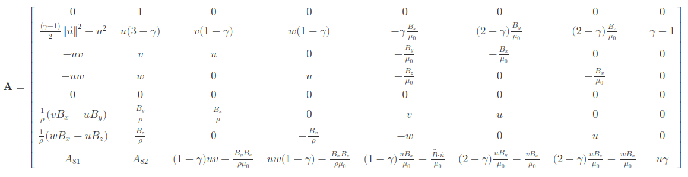

### A Brief Primer on Ideal MHD
&nbsp;&nbsp;&nbsp;&nbsp; Ideal Magnetohydrodynamics (MHD), is the simplest possible framework for modelling a plasma as a fluid. This is powerful, as it allows us to study the macroscopic dynamics of the plasma without needing to enmesh ourselves with the microscopic details, which is the purview of kinetic theory. Fusion energy researchers, in particular, deploy Ideal MHD to understand the equilibrium of different magnetic configurations. In conservative form, meaning there are no external sources of mass, momentum, energy, or magnetic field, the model can be written as,

$$
\pdv{\vec{Q}}{}{t} + \div \mathbf{T} = 0
\label{eq:imhd_consform}
$$

stating that the evolution of the Ideal MHD variables, 

$$
\vec{Q} = \begin{bmatrix}
\rho \\ 
\rho u \\
\rho v \\
\rho w \\
B_{x} \\
B_{y} \\
B_{z} \\
e
\end{bmatrix}^{T}
$$

is balanced by the divergence of the respective fluxes, expressed by the rank-2 tensor, $\mathbf{T}$,

$$
\mathbf{T} = \begin{bmatrix}
\vec{F} \quad \vec{G} \quad \vec{H} 
\end{bmatrix}^{T}
$$

&nbsp;&nbsp;&nbsp;&nbsp; The components of $\mathbf{T}$ are the fluxes of Ideal MHD variables in the x-, y-, and z-directions, respectively. The x-directed fluxes, $\vec{F}$, are expressed as,

$$
\vec{F} = \begin{bmatrix}
\rho u \\ 
\rho u^{2} - \frac{B_{x}^{2}}{\mu_{0}} + p + \frac{B^{2}}{2\mu_{0}} \\
\rho uv - \frac{B_{y}B_{x}}{\mu_{0}} \\
\rho uw - \frac{B_{z}B_{x}}{\mu_{0}} \\
0 \\
vB_{x} - uB_{y} \\
wB_{x} - uB_{z} \\
(e + p + \frac{B^{2}}{2\mu_{0}})u - \frac{\vec{B} \cdot \vec{u}}{\mu_{0}}B_{x}
\end{bmatrix}
$$

the y-directed fluxes, $\vec{G}$, 

$$
\vec{G} = \begin{bmatrix}
\rho v \\ 
\rho uv - \frac{B_{y}B_{x}}{\mu_{0}} \\
\rho v^{2} - \frac{B_{y}^{2}}{\mu_{0}} + p + \frac{B^{2}}{2\mu_{0}} \\
\rho vw - \frac{B_{y}B_{z}}{\mu_{0}} \\
uB_{y} - vB_{x} \\
0 \\
wB_{y} - vB_{z} \\
(e + p + \frac{B^{2}}{2\mu_{0}})v - \frac{\vec{B} \cdot \vec{u}}{\mu_{0}}B_{y}
\end{bmatrix}
$$

and the z-directed fluxes, $\vec{H}$,

$$
\vec{H} = \begin{bmatrix}
\rho w \\ 
\rho uw - \frac{B_{x}B_{z}}{\mu_{0}} \\
\rho vw - \frac{B_{y}B_{z}}{\mu_{0}} \\
\rho w^{2} - \frac{B_{z}^{2}}{\mu_{0}} + p + \frac{B^{2}}{2\mu_{0}} \\
uB_{z} - wB_{x} \\
vB_{z} - wB_{y} \\
0 \\
(e + p + \frac{B^{2}}{2\mu_{0}})w - \frac{\vec{B} \cdot \vec{u}}{\mu_{0}}B_{z}
\end{bmatrix}
$$

The internal energy, $e$, of the plasma is given by,

$$
e = \frac{p}{\gamma - 1} + \frac{B^{2}}{2\mu_{0}} + \frac{\rho \norm{u}^{2}}{2}
$$

where $p = nk_{B}T$ is the plasma pressure, and $\gamma = \frac{5}{3}$ is the adiabatic constant for a gas with 3 degrees of freedom. Lastly, the $\grad$ operator is just the familiar gradient from vector calculus,

$$
\grad = \begin{bmatrix}
\pdv{}{}{x} \quad \pdv{}{}{y} \quad \pdv{}{}{z}
\end{bmatrix}
$$

the $\norm{}$ operator is the familiar 2-norm from linear algebra,

$$
\norm{\vec{u}}^{2} = \sum_{i}^{N} u_{i}^{2}
$$

and the $\cdot$ operator is the inner product between two vectors,

$$
\vec{B}\cdot\vec{u} = \sum_{i} B_{i}u_{i}
$$

### The Flux Jacobians
&nbsp;&nbsp;&nbsp;&nbsp; The Ideal MHD model in conservative form, Equation (\ref{eq:imhd_consform}), can therefore be expanded,

$$
\label{eq:imhd_expanded}
\pdv{\vec{Q}}{}{t} + \pdv{\vec{F}}{}{x} + \pdv{\vec{G}}{}{y} + \pdv{\vec{H}}{}{z} = 0
$$

Physicists frequently like to wave their hands, and perform such mathematical chicanery as saying things like 

$$
\dv{y}{\not x}\dv{\not x}{t} = \dv{y}{t}
$$

which frustrates mathematicians. Regardless, we can play that kind of trick here, to Equation (\ref{eq:imhd_expanded}), and expand it further,

$$
\begin{align}
(\ref{eq:imhd_expanded}) \rightarrow \pdv{\vec{Q}}{}{t} + \pdv{\vec{F}}{}{\vec{Q}}\pdv{\vec{Q}}{}{x} + \pdv{\vec{G}}{}{\vec{Q}}\pdv{\vec{Q}}{}{y} + \pdv{\vec{H}}{}{\vec{Q}}\pdv{\vec{Q}}{}{z} &= 0 \\
\therefore \pdv{\vec{Q}}{}{t} + \mathbf{A}\pdv{\vec{Q}}{}{x} + \mathbf{B}\pdv{\vec{Q}}{}{y} + \mathbf{C}\pdv{\vec{Q}}{}{z} &= 0
\end{align}
$$

The rank-2 tensors, $\mathbf{A}, \mathbf{B}, \mathbf{C}$, are known as the $\textit{Flux Jacobians}$, and their components are defined in the following manner,

$$
\begin{align}
A_{ij} &= \pdv{F_{i}}{}{Q_{j}}\left.\right|_{Q_{k}} \\
B_{ij} &= \pdv{G_{i}}{}{Q_{j}}\left.\right|_{Q_{k}} \\
C_{ij} &= \pdv{H_{i}}{}{Q_{j}}\left.\right|_{Q_{k}} \\
\end{align}
$$

where the $\left.\right|_{Q\_{k}}$ notation indicates that the derivative is taken *while holding all other fluid variables constant*. 
This point is italicized, because it is crucially important for computing the flux jacobians, which is necessary to do in order to understand the properties, and stability, of the Ideal MHD system. 

To illustrate, consider the $A_{11}$ term,

$$
A_{11} = \pdv{\rho u}{}{\rho}\left.\right|_{Q_{k}}
$$

On the surface, this looks like it should evaluate to $A_{11} = u$, however, because $\rho u$ itself is one of the fluid variables, which is being held constant in this case since it is not the variable that is being differentiated with respect to, $A_{11} = 0$ is the *actual* correct answer.There are eight flux terms, eight variables, and three flux jacobians, so in total there are one-hundred, and ninety-two, derivatives which must be carefully taken in this manner in order to fully compute them. 

### Motivation
&nbsp;&nbsp;&nbsp;&nbsp; Besides curiosity, the mathematical exercise, or to better understand the properties of the Ideal MHD equations, one of the primary reasons to calculate the flux jacobians is to understand the stability of a numerical simulation. All information is transmitted via modes, e.g., the sound waves that we hear, the light waves that we see, the variations in density that we smell, the pressure waves that we feel, etc.. In fluid dynamics, and more broadly in magnetohydrodynamics, we make various assumptions, and approximations, about the properties of a system in order to derive a set of governing equations. These governing equations capture various aspects of the system, and discard others. What information is transmitted, and how, is determined by the *fluid characteristics*, i.e., the different modes that the system supports, which are encoded by the flux jacobians, namely they are the eigenvalues, $\\{\lambda\\}$. 

&nbsp;&nbsp;&nbsp;&nbsp; To visualize this, fluid dynamicists use *characteristic curves*, which are essentially graphs with $t$ as the ordinate (on the "y-axis"), and $x$ as the abscissa (on the "x-axis"). This kind of graph shows where in the domain information from a given mode, at a certain event, will have propagated to by a given time, also known as the *domain of influence*, as well as where in the domain the information of a given mode will have come from which influences the state of a given event at a given time, known as the *domain of dependence*. These characteristics have a finite, fixed, velocity so their curves are straight lines with the slope equal to the inverse of the characteristic's velocity, and which sweep out two cones when revolved 360 degrees around the time-axis, at a fixed event. The volume of these cones, one forwards, and one backwards, are the aforementioned domains.        

&nbsp;&nbsp;&nbsp;&nbsp; When we discretize the governing equations of a fluid system, on a mesh, in order to either solve them either explicitly (marching the state of the variables forward in time according to some method), or implicitly (inverting a matrix at each timestep in order to update the state of the variables), we introduce a synthetic characteristic speed to the solution, which is based on our choice of timestep, $\Delta t$, and the spacing of the mesh, $\Delta x$. Just like any characteristic, this numerical construct sweeps out a zone of dependence, and a zone of influence. In order for our simulation to remain stable, this numerical volume MUST contain all the information of the physical volume. In other words, the slope of the numerical characteristic, $\frac{\Delta t}{\Delta x}$, must be smaller than the slope associated with the fastest physical characteristic, $\abs{\frac{1}{\lambda_{max}}}$. Mathematically, in 1D,    

$$
\begin{align}
&\abs{\frac{\Delta t}{\Delta x}} \leq \abs{\frac{1}{\lambda_{max}}} \\
\rightarrow &\frac{\Delta t}{\Delta x}\abs{\lambda_{max}} \leq 1
\end{align}
$$

where we have assumed that $\Delta t > 0$. This can be easily extended to 3D,

$$
\begin{align}
\frac{\Delta t}{\Delta x}\abs{\lambda_{A,max}} + \frac{\Delta t}{\Delta y}\abs{\lambda_{B,max}} + \frac{\Delta t}{\Delta z}\abs{\lambda_{C,max}} \leq 1
\end{align}
$$

### $\mathbf{A}, \mathbf{B}$, and $\mathbf{C}$
&nbsp;&nbsp;&nbsp;&nbsp; Before determining the eigenvalues of the Ideal MHD Flux Jacobians, which is a subject for a future post, the one-hundred, and ninety-two, components that make them up must be computed first. Here is the result,

$$
\mathbf{A} = \begin{bmatrix}
0 & 1 & 0 & 0 & 0 & 0 & 0 & 0 \\
\frac{(\gamma - 1)}{2}\norm{\vec{u}}^{2} - u^{2} & u(3 - \gamma) & v(1 - \gamma) & w(1 - \gamma) & -\gamma \frac{B_{x}}{\mu_{0}} & (2 - \gamma)\frac{B_{y}}{\mu_{0}} & (2- \gamma)\frac{B_{z}}{\mu_{0}} & \gamma - 1 \\
-uv & v & u & 0 & -\frac{B_{y}}{\mu_{0}} & -\frac{B_{x}}{\mu_{0}} & 0 & 0 \\
-uw & w & 0 & u & -\frac{B_{z}}{\mu_{0}} & 0 & -\frac{B_{x}}{\mu_{0}} & 0 \\
0 & 0 & 0 & 0 & 0 & 0 & 0 & 0 \\
\frac{1}{\rho}\left(vB_{x} - uB_{y}\right) & \frac{B_{y}}{\rho} & -\frac{B_{x}}{\rho} & 0 & -v & u & 0 & 0 \\
\frac{1}{\rho}\left(wB_{x} - uB_{z}\right) & \frac{B_{z}}{\rho} & 0 & -\frac{B_{x}}{\rho} & -w & 0 & u & 0 \\
A_{81} & A_{82} & (1 - \gamma)uv - \frac{B_{y}B_{x}}{\rho\mu_{0}} & uw(1 - \gamma) - \frac{B_{x}B_{z}}{\rho\mu_{0}} & (1 - \gamma)\frac{uB_{x}}{\mu_{0}} - \frac{\vec{B}\cdot\vec{u}}{\mu_{0}} & (2 - \gamma)\frac{uB_{y}}{\mu_{0}} - \frac{vB_{x}}{\mu_{0}} & (2 - \gamma)\frac{uB_{z}}{\mu_{0}} - \frac{wB_{x}}{\mu_{0}} & u\gamma
\end{bmatrix}
$$

where, 

$$
\begin{align}
A_{81} &= u\left[(\gamma - 1)\norm{\vec{u}}^{2} - \frac{1}{\rho}(\gamma e + (2 - \gamma)\frac{B^{2}}{2\mu_{0}})\right] + B_{x}\frac{\vec{B}\cdot\vec{u}}{\rho\mu_{0}} \\
A_{82} &= \frac{1}{\rho}\left[\gamma e + (2 - \gamma)\frac{B^{2}}{2\mu_{0}}\right] + (1 - \gamma)\left(u^{2} + \frac{\norm{\vec{u}}^{2}}{2}\right) - \frac{B_{x}^{2}}{\rho\mu_{0}}
\end{align}
$$

$$
\mathbf{B} = \begin{bmatrix}
0 & 0 & 1 & 0 & 0 & 0 & 0 & 0 \\
-uv & v & u & 0 & -\frac{B_{y}}{\mu_{0}} & -\frac{B_{x}}{\mu_{0}} & 0 & 0 \\
\frac{(\gamma - 1)}{2}\norm{\vec{u}}^{2} - v^{2} & (1 - \gamma)u & (3 - \gamma)v & (1 - \gamma)w & (2-\gamma)\frac{B_{x}}{\mu_{0}} & -\gamma\frac{B_{y}}{\mu_{0}} & (2 - \gamma)\frac{B_{z}}{\mu_{0}} & \gamma - 1 \\
-vw & 0 & w & v & 0 & -\frac{B_{z}}{\mu_{0}} & -\frac{B_{y}}{\mu_{0}} & 0 \\
\frac{1}{\rho}(vB_{x} - uB_{y}) & \frac{B_{y}}{\rho} & -\frac{B_{x}}{\rho} & 0 & -v & u & 0 & 0 \\
0 & 0 & 0 & 0 & 0 & 0 & 0 & 0 \\
\frac{1}{\rho}(vB_{z} - wB_{y}) & 0 & -\frac{B_{z}}{\rho} & \frac{B_{y}}{\rho} & 0 & w & -v & 0 \\
B_{81} & (1 - \gamma)uv - \frac{B_{x}B_{y}}{\rho\mu_{0}} & B_{83} & (1 - \gamma)vw - \frac{B_{y}B_{z}}{\rho\mu_{0}} & (2 - \gamma)\frac{vB_{x}}{\mu_{0}} - \frac{uB_{y}}{\mu_{0}} & (1 - \gamma)\frac{vB_{y}}{\mu_{0}} + B_{y}\frac{\vec{u}\cdot\vec{B}}{\mu_{0}} & (2-\gamma)\frac{vB_{z}}{\mu_{0}} - \frac{wB_{y}}{\mu_{0}} & v\gamma 
\end{bmatrix}
$$

where,

$$
\begin{align}
B_{81} &= v\left[(\gamma - 1)\norm{\vec{u}}^{2} - \frac{1}{\rho}(\gamma e + (2 - \gamma)\frac{B^{2}}{2\mu_{0}})\right] + B_{y}\frac{\vec{B}\cdot\vec{u}}{\rho\mu_{0}} \\
B_{83} &= \frac{1}{\rho}\left[\gamma e + (2 - \gamma)\frac{B^{2}}{2\mu_{0}}\right] + (1 - \gamma)\left(v^{2} + \frac{\norm{\vec{u}}^{2}}{2}\right) - \frac{B_{y}^{2}}{\rho\mu_{0}}
\end{align}
$$

$$
\mathbf{C} = \begin{bmatrix}
0 & 0 & 0 & 1 & 0 & 0 & 0 & 0 \\
-uw & w & 0 & u & -\frac{B_{z}}{\mu_{0}} & 0 & -\frac{B_{x}}{\mu_{0}} & 0 \\
-vw & 0 & w & v & -\frac{B_{z}}{\mu_{0}} & 0 & -\frac{B_{x}}{\mu_{0}} & 0 \\
\frac{(\gamma - 1)}{2}\norm{\vec{u}}^{2} - w^{2} & (1 - \gamma)u & (1 - \gamma)v & (3 - \gamma)w & (2 - \gamma)\frac{B_{x}}{\mu_{0}} & (2 - \gamma)\frac{B_{y}}{\mu_{0}} & -\gamma\frac{B_{y}}{\mu_{0}} & \gamma - 1 \\
\frac{1}{\rho}(w B_{x} - uB_{z}) & \frac{B_{z}}{\rho} & 0 & -\frac{B_{x}}{\rho} & -w & 0 & u & 0 \\
\frac{1}{\rho}(wB_{y} - vB_{z}) & 0 & \frac{B_{z}}{\rho} & -\frac{B_{y}}{\rho} & 0 & -w & v & 0 \\
0 & 0 & 0 & 0 & 0 & 0 & 0 & 0 \\
C_{81} & (1 - \gamma)uw - \frac{B_{x}B_{z}}{\rho\mu_{0}} & (1 - \gamma)vw - \frac{B_{y}B_{z}}{\rho\mu_{0}} & C_{84} & (2-\gamma)\frac{wB_{x}}{\mu_{0}} - \frac{uB_{z}}{\mu_{0}} & (2 - \gamma)\frac{wB_{y}}{\mu_{0}} - \frac{vB_{z}}{\mu_{0}} & (1-\gamma)\frac{wB_{z}}{\mu_{0}} - \frac{\vec{u}\cdot\vec{B}}{\mu_{0}} & w\gamma
\end{bmatrix}
$$

where,

$$
\begin{align}
C_{81} &= w\left[(\gamma - 1)\norm{\vec{u}}^{2} - \frac{1}{\rho}(\gamma e + (2 - \gamma)\frac{B^{2}}{2\mu_{0}})\right] + B_{z}\frac{\vec{B}\cdot\vec{u}}{\rho\mu_{0}} \\
C_{84} &= \frac{1}{\rho}\left[\gamma e + (2 - \gamma)\frac{B^{2}}{2\mu_{0}}\right] + (1 - \gamma)\left(w^{2} + \frac{\norm{\vec{u}}^{2}}{2}\right) - \frac{B_{z}^{2}}{\rho\mu_{0}}
\end{align}
$$

As aforementioned, this is a great mathematical exercise, and one that took me 8 hours of solid work (non-contiguous) to do. I would love to hear from anyone who catches a mistake in these expressions at the email at the bottom of the page. 

<!-- 
*Here is the x-flux jacobian again so that the image will be attached to my post on LinkedIn*
 
WOULD NEED TO DELETE POST, AND POST ANEW TO CHANGE LINK PREVIEW 
-->

<!-- ### $\mathbf{A}$
&nbsp;&nbsp;&nbsp;&nbsp; In this section, we are going to calculate **ALL** the the components of the X-Flux Jacobian, $\mathbf{A}$. For the sake of brevity, I am going to drop the notation from the derivative that indicates it should be taken with all other fluid variables held fixed, i.e., treated as constant, but it is crucial to remember that they are. The first row is fairly trivial,

$$
\begin{align}
A_{11} &= 0 \\
A_{12} &= \pdv{\rho u}{}{\rho u} = 1 \\
A_{13} &= \pdv{\rho u}{}{\rho v} = 0 \\
A_{14} &= \pdv{\rho u}{}{\rho w} = 0 \\
A_{15} &= \pdv{\rho u}{}{B_{x}} = 0 \\
A_{16} &= \pdv{\rho u}{}{B_{y}} = 0 \\
A_{17} &= \pdv{\rho u}{}{B_{z}} = 0 \\
A_{18} &= \pdv{\rho u}{}{e} = 0
\end{align}
$$ 

The second row presents a challenge with the first component,

$$
\begin{align}

\end{align}
$$

### $\mathbf{B}$
&nbsp;&nbsp;&nbsp;&nbsp; In this section, we are going to calculate **ALL** the the components of the Y-Flux Jacobian, $\mathbf{B}$. As when calculating $\mathbf{A}$, the first row is fairly trivial.

### $\mathbf{C}$
&nbsp;&nbsp;&nbsp;&nbsp; In this section, we are going to calculate **ALL** the the components of the Z-Flux Jacobian, $\mathbf{C}$. As when calculating $\mathbf{A}$, and $\mathbf{B}$, the first row is fairly trivial. -->
