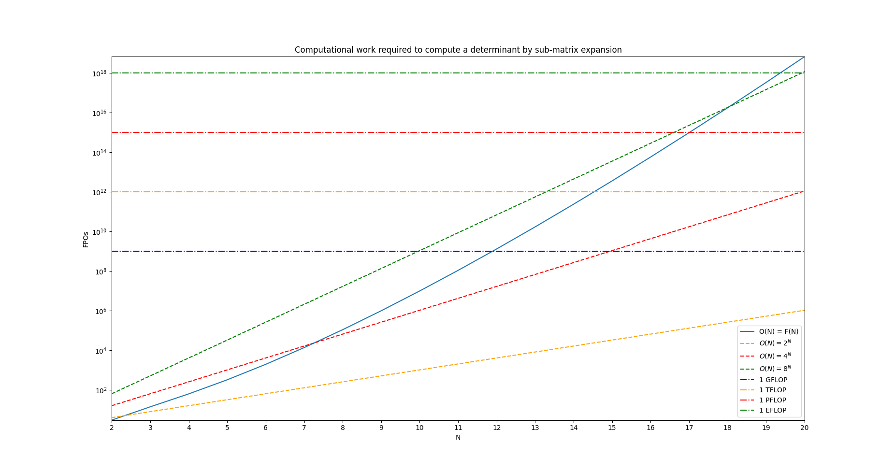

### Recap
&nbsp;&nbsp;&nbsp;&nbsp; Previously, I have written about [the Flux Jacobians of Ideal MHD](./2024-08-15_fluxjacobian), which are an idea that is central to this post. Recapping briefly, Ideal MHD is the simplest, meaningful, fluid description of a plasma. Its main application is in the field of fusion energy, where it is used to describe the equilibrium of magnetic configurations. In the absence of external sources of mass, momentum, energy, and magnetic field, we can write the system in the following form,

$$
\label{eq:imhd_system_fj}
\pdv{\vec{Q}}{}{t} + \mathbf{A}\pdv{\vec{Q}}{}{x} + \mathbf{B}\pdv{\vec{Q}}{}{y} + \mathbf{C}\pdv{\vec{Q}}{}{z} = 0
$$

where $\vec{Q}$ are the [Ideal MHD variables](./2024-08-15_fluxjacobian#eq:imhdvars), and $\mathbf{A}, \mathbf{B}$, and $\mathbf{C}$, are the [Flux Jacobians](./2024-08-15_fluxjacobian#the-flux-jacobians). These mathematical objects express how the fluxes vary with respect to the fluid variables, and they contain important information about the properties of the system related to the type of the equations, their characteristics, and stability.

### Eigenvalues and Eigenvectors
&nbsp;&nbsp;&nbsp;&nbsp; If you study physics, or engineering, to a serious degree, then you will eventually run into the concepts of an "eigenvalue", and an "eigenvector". If you are already familiar, and comfortable, with what these are, and just want to get to the meat of this post [where the characteristic equation of the Ideal MHD Flux Jacobians is derived](#the-ideal-mhd-characteristic-equation), then please follow this link, and feel free to skip this section as it will be a brief introduction to these concepts. 

&nbsp;&nbsp;&nbsp;&nbsp; These, somewhat intimidating, names bely deceptively simple ideas, but which are also devilishly rich with detail to understand the deeper you go, and understanding which begins by talking about the idea of a *system*. Intuitively, you can understand a system as something where input goes in, something happens to it, and output comes out. For example, the American education system takes in children around the age of five, obliges them to sit down and learn for seven hours a day, five days a week, asks them do homework for another three starting when they reach high school, and keeps them in this cycle for thirteen years. What comes out of this system is hopefully an educated, well-socialized populace of workers who can think critically, make informed decisions, and perform tasks which add value to society in exchange for a cut of this value in the form of monetary compensation which allows them to meet their basic needs, and do things which they find fulfilling.     

&nbsp;&nbsp;&nbsp;&nbsp; The difference in physics, and engineering, is that the systems which we study in these fields are rigorously defined mathematically, rather than just described qualitatively, meaning we have a clear idea of what the inputs, outputs, and transformation are. A **matrix** is the primary form in which a system is defined, and it is just a collection of numbers, (in the form of a rank-2 tensor, to be specific), that has two dimensions to its structure. For example, 

$$
\mathbf{R} = \begin{bmatrix}
2 & 1 & 3 \\
1 & 3 & -2 \\
0 & 5 & -1
\end{bmatrix}
$$

is the matrix which describes the transformation from one coordinate system, $(x_{1}, y_{1}, z_{1})$ to another $(x_{2}, y_{2}, z_{2})$, that is defined by the following system of equations,

$$
\begin{align}
x_{2} &= 2x_{1} + y_{1} + 3z_{1} \\
y_{2} &= x_{1} + 3y_{1} - 2z_{1} \\
z_{2} &= 5y_{1} - z_{1}
\end{align}
$$

What this means, in practice, is if we had a vector, which is a one-dimensional way of storing information, that we were looking at in the first coordinate system, where it was described by the numbers,

$$
\vec{u}_{in1} = \begin{bmatrix}
4 \\
-3 \\
1
\end{bmatrix}
$$

then, if we were to look at it in the second coordinate system, it would be described by a new triplet of numbers,

$$
\vec{u}_{in2} = \mathbf{R}\vec{u}_{in1} = \begin{bmatrix}
4*2 - 3*1 + 1*3 \\
4*1 - 3*3 + 1*(-2) \\
4*0 - 3*5 - 1*1
\end{bmatrix}
= \begin{bmatrix}
8 \\
-7 \\
-16
\end{bmatrix}
$$

All vectors can be boiled down to a magnitude, and a direction. The *magnitude* of a vector is a measure of how long it is, and its direction gives a sense for its orientation. If we compare the magnitude of these two vectors, and their orientations, we will notice they're different when viewed in these two coordinate systems, even though we're talking about the **same** underlying mathematical object. *Great*, you may be thinking, *when do we get to what eigenvectors, and eigenvalues, are?* 

&nbsp;&nbsp;&nbsp;&nbsp; For a given system, there is a set of vectors which *do not rotate* when the system is applied to it. Their lengths will change, but their orientations will not. These vectors are termed **eigenvectors**, and the factors by which their lengths change, are the **eigenvalues**. In principle, the eigenvalues, $\\{\lambda\\}$, of a system, $\mathbf{A}$, can be determined by solving for the roots of a *characteristic polynomial*, which is defined by the equation,

$$
det(\mathbf{A} - \lambda\mathbf{I}) = 0
$$

### Determinants 

The *determinant* is a function, $det()$, which takes in an $N\times N$ matrix of real numbers, and returns a scalar, so rigorously speaking, $det: \mathbb{R}^{N\times N} \rightarrow \mathbb{R}$. The determinant of a $2\times 2$ matrix is defined in the following manner,

$$
det(\mathbf{A}_{2by2}) = \begin{vmatrix}
a & b \\
c & d 
\end{vmatrix} = ad - bc
$$

Notice that computing this requires the performance of 3 floating-point operations (FPOs), so we shall say that,

$$
F(2) = 3
$$ 

where $F(N)$ expresses the amount of work it takes to compute the determinant of an $N\times N$ matrix. $F(2)$ is a trivial amount of work for a computer, and a straightforward task for a human with a calculator. The determinant of a $3\times 3$ matrix can be expressed as a sum of determinants of $2\times 2$ sub-matrices,

$$
det(\mathbf{A}_{3by3}) = \begin{vmatrix}
a & b & c \\
d & e & f \\
g & h & i
\end{vmatrix} = 
a \begin{vmatrix}
e & f \\
h & i
\end{vmatrix}
- b \begin{vmatrix}
d & f \\
g & i
\end{vmatrix}
+ c \begin{vmatrix}
d & e \\
g & h 
\end{vmatrix}
$$

&nbsp;&nbsp;&nbsp;&nbsp; If you have taken a course in linear algebra, or calculus, this formula will hopefully be familiar to you. You might also remember that it doesn't matter what row, or column, that you use as the leading factors of the sub-matrix expansion, so long as you remember to multiply the ones whose row and column index sum to an odd number, by $-1$. Both of these facts are important, the former because it is a way of drastically reducing the amount of work necessary to compute a determinant for matrices that have an appreciable number of zeros along a certain row or column, as you can choose to expand along this dimension, and therefore trivialize much of the algebra. In general, the amount of work we have to do to compute a $3\times 3$ determinant is,

$$
F(3) = 3 * F(2) + 3 + 2
$$

&nbsp;&nbsp;&nbsp;&nbsp; The first term in the above is the number of FPOs that it takes to compute the determinants of the sub-matrices, the second term is the number of FPOs to multiply these by their leading factors, and then the last term is the number of addition operations to sum everything together. The determinant of a $4\times 4$ matrix can be expressed as a sum of determinants of $3\times 3$ sub-matrices, 

$$
det(\mathbf{A}_{4by4}) = \begin{vmatrix}
a & b & c & d \\
e & f & g & h \\
i & j & k & l \\
m & n & o & p
\end{vmatrix}
= a \begin{vmatrix}
f & g & h \\
j & k & l \\
n & o & p
\end{vmatrix}
- b \begin{vmatrix}
e & g & h \\
i & k & l \\
m & o & p
\end{vmatrix}
+ c \begin{vmatrix}
e & f & h \\
i & j & l \\
m & n & p
\end{vmatrix}
- d \begin{vmatrix}
e & f & g \\
i & j & k \\
m & n & o
\end{vmatrix}
$$

and so on, and so forth (larger dimensions not rendered here for obvious reasons). In general, for an $N\times N$ matrix, you will need to perform $N * F(N-1)$ FPOs to compute the sub-matrix determinants, $N$ more FPOs to multiply these together with their leading factors, and finally $N-1$ FPOs to sum everything together. This is a recurrence relation with $F(2) = 3$ as the base case,

$$
\begin{align}
F(N) &= N * F(N-1) + 2N - 1 \\
&= N(F(N-1) + 2) - 1 
\end{align}
$$

| N | F(N)   |
| - | ------ |
| 2 | 3      |
| 3 | 14     |
| 4 | 63     |
| 5 | 324    |
| 6 | 1955   |
| 7 | 13698  |
| 8 | 109599 |

&nbsp;&nbsp;&nbsp;&nbsp; It is apparent, visualized in the above figure with a few values tabulated below, that computing the determinant is a very expensive, and time-consuming operation, roughly $O(N^{N})$. Just to hammer the point home, lines representing when an implementation would need GFLOPs, TFLOPs, PFLOPs, and EFLOPS of performance, in order to compute the problem in one second, are plotted alongside the data representing the runtime of the sub-matrix expansion algorithm. It is clear that this is not a wise, or worthwhile, task to be doing for unstructured matrices of any appreciable size, especially because doing so in the context of an eigenvalue problem yields an $Nth$ degree polynomial whose roots must then be found. 

&nbsp;&nbsp;&nbsp;&nbsp; In practice, instead of doing this, there are various *matrix decompositions*[^1] which can express the given matrix as a product of several other matrices, in one of which the eigenvalues are explicitly stored, that are employed for finding the eigenvalues of very large systems. High-performance libraries exist to do these computations on CPU, and GPU, which can be useful for implementing an adaptive timestep in a simulation. However, it should be noted that these decompositions are still expensive in of themselves, typically requiring between $O(N logN) \sim O(N^{3})$ work, and many of which are constrained as to what matrices they can operate on.  

### The Ideal MHD Characteristic Equation
&nbsp;&nbsp;&nbsp;&nbsp; There are three matrices which are naturally relevant to Ideal Magnetohydrodynamics, namely, the [Flux Jacobians](./2024-08-15_fluxjacobian#appendix), $\mathbf{A}, \mathbf{B}$, and $\mathbf{C}$, which are written out in their full form where [this hyperlink](./2024-08-15_fluxjacobian#appendix) leads. These matrices describe the rate at which the fluxes in the x-,y-, and z-directions, respectively, change with respect to a change in the fluid variables, $\vec{Q}$. From dimensional analysis of Equation (\ref{eq:imhd_system_fj}), you can see that the units of the Flux Jacobians must be that of velocity, distance over time, and so the eigenvalues of these matrices have a special interpretation as *characteristic speeds*. The stability of a numerical code that solves the Ideal MHD system [depends on the value of these characteristic speeds](./2024-08-15_fluxjacobian#motivation), in comparison to the characteristic speed of information propagation on the simulation mesh, namely, 

$$
\begin{align}
\frac{\Delta t}{\Delta x}\abs{\lambda_{A,max}} + \frac{\Delta t}{\Delta y}\abs{\lambda_{B,max}} + \frac{\Delta t}{\Delta z}\abs{\lambda_{C,max}} \leq 1
\end{align}
$$

must be satisfied.

&nbsp;&nbsp;&nbsp;&nbsp; The **equation type** of a system of PDEs is also defined by the eigenvalues of these matrices. There are three basic kinds of PDEs, *hyperbolic*, *parabolic*, and *elliptic*. Hyperbolic equations describe wave-like behavior, parabolic equations describe diffusion-like behavior, and elliptic equations describe steady-state behavior, or eigenvalue problems, where the challenge is determining a spectrum of numbers, instead of evolving the state of a dynamical system. What type a system of PDEs is has important implications for the kinds of numerical algorithms which are best suited to solving it. Furthermore, some PDEs can be of mixed-type, perhaps being hyperbolic in one part of the domain, and parabolic in another, due to nonuniformity in the coefficients. Fortunately, Ideal MHD does not have this problem, because the only coefficients in the system are two constants, $\gamma$, and $\mu_{0}$. As we will see, it is hyperbolic in the entire domain, which is based on its eigenvalues being real numbers with zero imaginary part. 

&nbsp;&nbsp;&nbsp;&nbsp; To begin finding the eigenvalues of Ideal Magnetohydrodynamics, we should first write out $\mathbf{A} - \lambda\mathbf{I}$ in a form that makes taking the determinant easier,

$$
\mathbf{A} - \lambda\mathbf{I} = 
\begin{bmatrix}
-\lambda & 1 & 0 & 0 & 0 & 0 & 0 & 0 \\
A_{21} & A_{22} - \lambda & A_{23} & A_{24} & A_{25} & A_{26} & A_{27} & \gamma - 1 \\
-uv & v & u - \lambda & 0 & A_{35} & A_{36} & 0 & 0 \\
-uw & w & 0 & u - \lambda & A_{45} & 0 & A_{47} & 0 \\
0 & 0 & 0 & 0 & -\lambda & 0 & 0 & 0 \\
A_{61} & A_{62} & A_{63} & 0 & -v & u - \lambda & 0 & 0 \\
A_{71} & A_{72} & 0 & A_{74} & -w & 0 & u - \lambda & 0 \\
A_{81} & A_{82} & A_{83} & A_{84} & A_{85} & A_{86} & A_{87} & u\gamma - \lambda
\end{bmatrix}
$$

The fifth row has only a single non-zero element, so if we perform our sub-matrix expansion about it, then we only have to take a single $7\times 7$ determinant,

$$
det(\mathbf{A} - \lambda\mathbf{I}) = 
-\lambda \begin{vmatrix}
-\lambda & 1 & 0 & 0 & 0 & 0 & 0 \\
A_{21} & A_{22} - \lambda & A_{23} & A_{24} & A_{26} & A_{27} & \gamma - 1 \\
-uv & v & u - \lambda & 0 & A_{36} & 0 & 0 \\
-uw & w & 0 & u - \lambda & 0 & A_{47} & 0 \\
A_{61} & A_{62} & A_{63} & 0 & u - \lambda & 0 & 0 \\
A_{71} & A_{72} & 0 & A_{74} & 0 & u - \lambda & 0 \\
A_{81} & A_{82} & A_{83} & A_{84} & A_{86} & A_{87} & u\gamma - \lambda
\end{vmatrix} = 0
$$

Unfortunately, the best choice we have here will result in two $6 \times 6$ determinants, but notice beforehand that we can already determine one of our eigenvalues just from inspecting the above equation, since $\lambda = 0$ is a valid solution to it. Consequently, we can focus on just when the determinant in the above is equal to zero, as any non-trivial solutions to the eigenvalues require it,

$$
\rightarrow - \lambda \begin{vmatrix}
A_{22} - \lambda & A_{23} & A_{24} & A_{26} & A_{27} & \gamma - 1 \\
v & u - \lambda & 0 & A_{36} & 0 & 0 \\
w & 0 & u - \lambda & 0 & A_{47} & 0 \\
A_{62} & A_{63} & 0 & u - \lambda & 0 & 0 \\
A_{72} & 0 & A_{74} & 0 & u - \lambda & 0 \\
A_{82} & A_{83} & A_{84} & A_{86} & A_{87} & u\gamma - \lambda
\end{vmatrix}
- \begin{vmatrix}
A_{21} & A_{23} & A_{24} & A_{26} & A_{27} & \gamma - 1 \\
-uv & u - \lambda & 0 & A_{36} & 0 & 0 \\
-uw & 0 & u - \lambda & 0 & A_{47} & 0 \\
A_{61} & A_{63} & 0 & u - \lambda & 0 & 0 \\
A_{71} & 0 & A_{74} & 0 & u - \lambda & 0 \\
A_{81} & A_{83} & A_{84} & A_{86} & A_{87} & u\gamma - \lambda
\end{vmatrix} = 0
$$

Space is getting tight, so let's call these determinants $D_{1}$, and $D_{2}$, respectively, meaning the above is written as,

$$
-\lambda D_{1} - D_{2} = 0
$$

The best we can do in both cases is expand using the last column, and get two $5\times 5$ determinants out of each. 

$$
\begin{align}
D_{1} &= -(\gamma - 1)\begin{vmatrix}
v & u - \lambda & 0 & A_{36} & 0 \\
w & 0 & u - \lambda & 0 & A_{47} \\
A_{62} & A_{63} & 0 & u - \lambda & 0 \\
A_{72} & 0 & A_{74} & 0 & u - \lambda \\
A_{82} & A_{83} & A_{84} & A_{86} & A_{87}
\end{vmatrix}
+ (u\gamma - \lambda)\begin{vmatrix}
A_{22} - \lambda & A_{23} & A_{24} & A_{26} & A_{27} \\
v & u - \lambda & 0 & A_{36} & 0 \\
w & 0 & u - \lambda & 0 & A_{47} \\
A_{62} & A_{63} & 0 & u - \lambda & 0 \\
A_{72} & 0 & A_{74} & 0 & u - \lambda \\
\end{vmatrix} 
\\
D_{2} &= -(\gamma - 1)\begin{vmatrix}
-uv & u - \lambda & 0 & A_{36} & 0 \\
-uw & 0 & u - \lambda & 0 & A_{47} \\
A_{61} & A_{63} & 0 & u - \lambda & 0 \\
A_{71} & 0 & A_{74} & 0 & u - \lambda \\
A_{81} & A_{83} & A_{84} & A_{86} & A_{87}
\end{vmatrix}
+ (u\gamma - \lambda)\begin{vmatrix}
A_{21} & A_{23} & A_{24} & A_{26} & A_{27} \\
-uv & u - \lambda & 0 & A_{36} & 0 \\
-uw & 0 & u - \lambda & 0 & A_{47} \\
A_{61} & A_{63} & 0 & u - \lambda & 0 \\
A_{71} & 0 & A_{74} & 0 & u - \lambda
\end{vmatrix} 
\end{align}
$$

We can rewrite this,

$$
\begin{align}
D_{1} &= -(\gamma - 1)D_{11} + (u\gamma - \lambda)D_{12} \\
D_{2} &= -(\gamma - 1)D_{21} + (u\gamma - \lambda)D_{22} \\
\therefore -\lambda&\left[(1-\gamma)D_{11} + (u\gamma - \lambda)D_{12}\right] + (\gamma-1)D_{21} + (\lambda - u\gamma)D_{22} = 0
\end{align}
$$

&nbsp;&nbsp;&nbsp;&nbsp; Unfortunately, there's no way around what we have to do next if we want to see this calculation through. The $D_{kl}$ are structured such that the simplest expansion we can break each of them down into involves three $4\times 4$ determinants per $D_{kl}$. The best decision we can make is to expand across the dimension with the simplest terms, yielding,    

$$
\begin{align}
D_{11} &= vD_{111} - (u - \lambda)D_{112} - A_{36}D_{113} \\
D_{12} &= -vD_{121} + (u - \lambda)D_{122} + A_{36}D_{123} \\
D_{21} &= -uvD_{211} - (u - \lambda)D_{212} - A_{36}D_{213} \\
D_{22} &= uvD_{221} + (u - \lambda)D_{222} + A_{36}D_{223}
\end{align}
$$

where,

$$
\begin{align}
D_{111} &= \begin{vmatrix}
0 & u - \lambda & 0 & A_{47} \\
A_{63} & 0 & u - \lambda & 0 \\
0 & A_{74} & 0 & u - \lambda \\
A_{83} & A_{84} & A_{86} & A_{87} 
\end{vmatrix} = -(u - \lambda)D_{1111} - A_{47}D_{1112}\\

D_{112} &= \begin{vmatrix}
w & u - \lambda & 0 & A_{47} \\
A_{62} & 0 & u - \lambda & 0 \\
A_{72} & A_{74} & 0 & u - \lambda \\
A_{82} & A_{84} & A_{86} & A_{87} 
\end{vmatrix} = -A_{62}D_{1121} - (u - \lambda)D_{1122}\\

D_{113} &= \begin{vmatrix}
w & 0 & u - \lambda & A_{47} \\
A_{62} & A_{63} & 0 & 0 \\
A_{72} & 0 & A_{74} & u - \lambda \\
A_{82} & A_{83} & A_{84} & A_{87} 
\end{vmatrix} = -A_{62}D_{1131} + A_{63}D_{1132}\\

D_{121} &= \begin{vmatrix}
A_{23} & A_{24} & A_{26} & A_{27} \\
0 & u - \lambda & 0 & A_{47} \\
A_{63} & 0 & u - \lambda & 0 \\
0 & A_{74} & 0 & u - \lambda
\end{vmatrix} = (u -\lambda)D_{1211} + A_{47}D_{1212}\\

D_{122} &=\begin{vmatrix}
A_{22}-\lambda & A_{24} & A_{26} & A_{27} \\
w & u - \lambda & 0 & A_{47} \\
A_{62} & 0 & u - \lambda & 0 \\
A_{72} & A_{74} & 0 & u - \lambda
\end{vmatrix} = A_{62}D_{1221} + (u - \lambda)D_{1222}\\

D_{123} &= \begin{vmatrix}
A_{22}-\lambda & A_{23} & A_{24} & A_{27} \\
w & 0 & u - \lambda & A_{47} \\
A_{62} & A_{63} & 0 & 0 \\
A_{72} & 0 & A_{74} & u - \lambda
\end{vmatrix} = A_{62}D_{1231} - A_{63}D_{1232}\\

D_{211} &= \begin{vmatrix}
0 & u - \lambda & 0 & A_{47} \\
A_{63} & 0 & u - \lambda & 0 \\
0 & A_{74} & 0 & u - \lambda \\
A_{83} & A_{84} & A_{86} & A_{87}
\end{vmatrix} = -A_{63}D_{2111} - (u - \lambda)D_{2112}\\

D_{212} &= \begin{vmatrix}
-uw & u - \lambda & 0 & A_{47} \\
A_{61} & 0 & u - \lambda & 0 \\
A_{71} & A_{74} & 0 & u - \lambda \\
A_{81} & A_{84} & A_{86} & A_{87}
\end{vmatrix} = -A_{61}D_{2121} - (u - \lambda)D_{2122}\\

D_{213} &= \begin{vmatrix}
-uw & 0 & u - \lambda & A_{47} \\
A_{61} & A_{63} & 0 & 0 \\
A_{71} & 0 & A_{74} & u - \lambda \\
A_{81} & A_{83} & A_{84} & A_{87}
\end{vmatrix} = -A_{61}D_{2131} + A_{63}D_{2132}\\

D_{221} &= \begin{vmatrix}
A_{23} & A_{24} & A_{26} & A_{27} \\
0 & u-\lambda & 0 & A_{47} \\
A_{63} & 0 & u - \lambda & 0 \\
0 & A_{74} & 0 & u - \lambda
\end{vmatrix} = (u - \lambda)D_{2211} + A_{47}D_{2212}\\

D_{222} &= \begin{vmatrix}
A_{21} & A_{24} & A_{26} & A_{27} \\
-uw & u-\lambda & 0 & A_{47} \\
A_{61} & 0 & u - \lambda & 0 \\
A_{71} & A_{74} & 0 & u - \lambda
\end{vmatrix} = A_{61}D_{2221} + (u - \lambda)D_{2222}\\

D_{223} &= \begin{vmatrix}
A_{21} & A_{23} & A_{24} & A_{27} \\
-uw & 0 & u-\lambda & A_{47} \\
A_{61} & A_{63} & 0 & 0 \\
A_{71} & 0 & A_{74} & u - \lambda
\end{vmatrix} = A_{61}D_{2231} - A_{63}D_{2232} 
\end{align}
$$

Yep, you guessed it, we're still not done. Remember when we determined the runtime complexity of computing a determinant? Each of these twelve, $4\times 4$, determinants expands into a sum of two $3\times 3$ determinants. There's really nothing else that can be done at this point except calculate them. The good news is that, due to their structure, many of these $3\times 3$ determinants can be reduced to just a single $2\times 2$ determinant which can be directly expanded into a scalar equation. In other words, we will finally be hitting the bedrock of this calculation, and then the remaining task to deriving the characteristic polynomial of Ideal MHD will be percolating these results upwards in order to obtain a 7th-degree polynomial in $\lambda$ that is equal to zero, i.e., $P_{7}(\lambda) = 0$. The roots of this equation are the eigenvalues, but as you might have guessed, actually determining these characteristics will be the subject of a future post.   

<!-- same goes for $\mathbf{B} - \lambda\mathbf{I}$, and $\mathbf{C} - \lambda\mathbf{I}$,

$$
\mathbf{B} - \lambda\mathbf{I} = 
\begin{bmatrix}
\end{bmatrix}
$$

$$
\mathbf{C} - \lambda\mathbf{I} = 
\begin{bmatrix}
\end{bmatrix}
$$ -->

<!-- &nbsp;&nbsp;&nbsp;&nbsp; While there are numerical routines implemented in C, and C++, which compute the eigenvalues of a matrix, there is little recourse to symbolically computing them (except the expensive Mathematica software, of course). However, by looking at the previous examples of how to compute a determinant by hand, we can notice that the determinant of the sub-matrices are multiplied by a leading factor, which is a value in the primary matrix. If this value is 0, then the associated sub-matrix determinant does not need to be computed, which means that if we are clever, and the primary matrix is full of zeroes (like the Ideal MHD Flux Jacobians are), then things can be greatly simplified!   -->

<!-- &nbsp;&nbsp;&nbsp;&nbsp; Long ago, in Fortran77, high-performance libraries were written to implement numerical linear algebra routines that performed this kind of task, among others. Fortran77, or F77 as it is lovingly-referred to, is also the number of expletives one might utter when dealing with a language full of such idiosyncracies as requiring there to be a fixed number of leading whitespaces before every line (if you thought *Python* whitespace was bad). As the language matured, these routines were ported to Fortran90, a much more enjoyable version of Fortran, C, and C++. Now, bindings exist in many languages to access these high-performance libraries, as well as ports of them which run on a GPU.     -->

<!-- References -->
[^1]: Trefethen and Bau, *Numerical Linear Algebra*, SIAM, 1997
